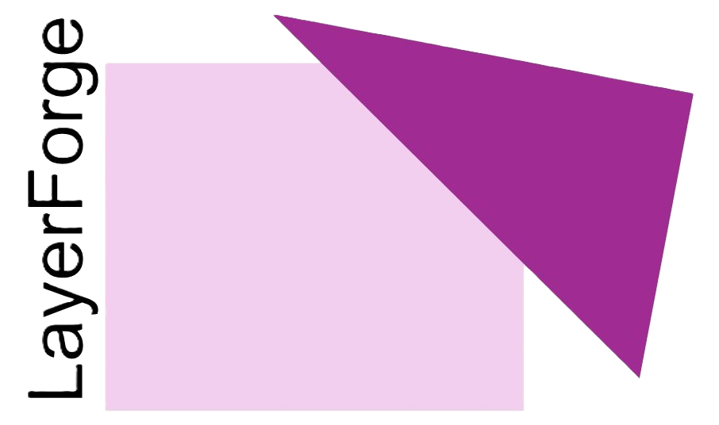

# LayerForge
<p align="center">
  
</p>


A plugin to annotate simple masks of multi-scale biological images, efficiently, and produce a paired mask output.

**Documentation: <https://mjbcowan.github.io/LayerForge/>**

LayerForge is  registers an `npe2` reader for `.tif`/`.tiff`/`.png`/`.jpg`/`.jpeg` (so `File > Open` / drag-and-drop just works) and a "LayerForge annotation panel" dock widget for defining classes, picking labels/shapes mode, and launching a session — see the [installation guide](https://mjbcowan.github.io/LayerForge/install/) for how colleagues install it into the official napari desktop app, and the [annotation protocol](https://mjbcowan.github.io/LayerForge/tutorials/annotation_session_napari/) for a no-coding-required, step-by-step guide to installing napari + the plugin and running an annotation session.

## Installation

For developers of this package:
```bash
pip install git+https://github.com/mjbcowan/LayerForge
```

For colleagues using the desktop napari app, see the [installation
guide](https://mjbcowan.github.io/LayerForge/install/) — download the
`.whl` from the [latest release](https://github.com/mjbcowan/LayerForge/releases)
and install it through napari's plugin manager.

## Documentation

The docs site is built with [MkDocs](https://www.mkdocs.org/) +
[Material](https://squidfunk.github.io/mkdocs-material/) and deployed to
GitHub Pages by `.github/workflows/docs.yml` on every push to `main`.
To preview it locally:

```bash
pip install -r docs/requirements.txt
mkdocs serve   # then open http://127.0.0.1:8000
```

## References and Acknowledgements
> **This _package_ is not officially affiliated with SpatialData, nor Napari**


Please cite the following if using this package. Sincere thanks to the developers and maintainers of these packages.

```bibtex
@article{marconato2025spatialdata,
  title={SpatialData: an open and universal data framework for spatial omics},
  author={Marconato, Luca and Palla, Giovanni and Yamauchi, Kevin A and Virshup, Isaac and Heidari, Elyas and Treis, Tim and Vierdag, Wouter-Michiel and Toth, Marcella and Stockhaus, Sonja and Shrestha, Rahul B and others},
  journal={Nature methods},
  volume={22},
  number={1},
  pages={58--62},
  year={2025},
  publisher={Nature Publishing Group US New York}
}
```

 ```bibtex
 @Manual{napari2019,
    title={napari: a multi-dimensional image viewer for Python},
    author={Sofroniew, N., Lambert, T., Bokota, G., Nunez-Iglesias, J., Sobolewski, P., Sweet, A., Gaifas, L., Evans, K., Burt, A., Doncila Pop, D., Yamauchi, K., Weber Mendonça, M., Buckley, G., Vierdag, W.-M., Royer, L., Can Solak, A., Harrington, K. I. S., Ahlers, J., Althviz Moré, D., … Zhao, R},
    year={2019},
    url={https://github.com/napari/napari},
    doi={https://doi.org/10.5281/zenodo.14427406}
 }
```
