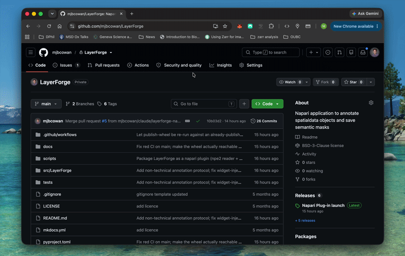
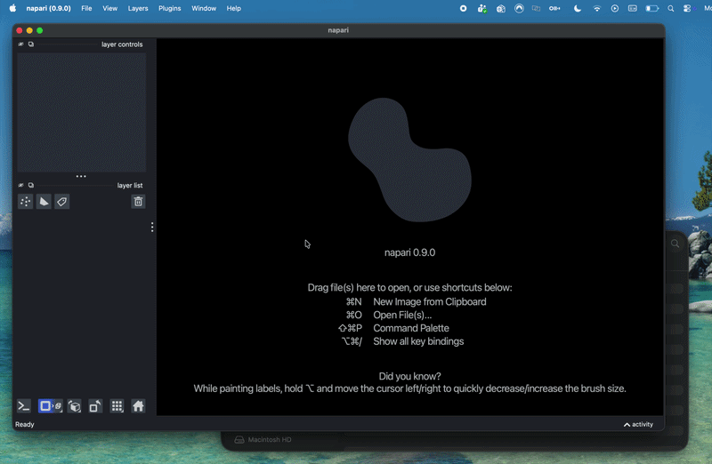
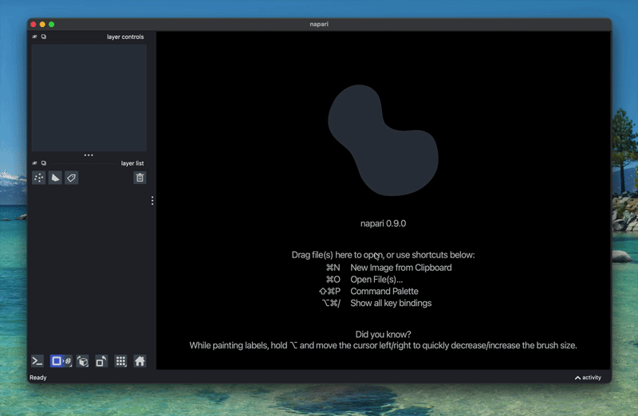

# Installation instructions

LayerForge ships as a **napari plugin**, not a standalone app. Colleagues
install the official napari desktop bundle once, then add LayerForge to it
with a single command.

## 1. Install napari (official, signed installer)

Download the appropriate installer from napari's GitHub releases:

1. Go to napari's official releases page:
   [github.com/napari/napari/releases](https://github.com/napari/napari/releases)
2. Under the latest release, download the installer for your operating
   system:
      - **Windows** → the `.exe` installer
      - **macOS** → the `.pkg` installer
3. Run the installer and accept the defaults. This is the same
   official, digitally-signed napari app used across the team — nothing
   custom.
4. Confirm it worked: open the **napari** app from your Start Menu /
   Applications folder. You should see an empty viewer window. Close it
   for now.


## 2. Get the LayerForge wheel

**Where to get it (pick whichever your team has set up):**

- **GitHub Releases (recommended — always available, no account needed)**
  — every published release attaches a
  `layerforge-<version>-py3-none-any.whl` file directly to it:
  [github.com/mjbcowan/LayerForge/releases](https://github.com/mjbcowan/LayerForge/releases)
  — click the latest release, then download the `.whl` from its
  **Assets**. The repository is public, so this works for anyone, signed
  in to GitHub or not.



## 3. Install the LayerForge plugin (one-time, per machine)

Once you have the `.whl` file (downloaded from GitHub, or from the share):

**Option A — napari's built-in Plugin Manager (recommended for most users)**

1. Open napari.
2. From the menu bar, choose **Plugins → Install/Uninstall Plugins…**
3. Near the bottom of the window there's a text box with faint grey
   placeholder text (something like *"install from 'pip' by name/url,
   or drop file…"*) and an **Install** button next to it. Fill it in
   one of two ways:
      - **Drag and drop**: open your file browser, find the `.whl`
        file, and drag it straight onto the plugin dialog window — the
        text box fills in automatically, **or**
      - **Type it in**: click the text box and paste the full path to
        the `.whl` file.
4. Click **Install** (or press Enter). A progress indicator appears
   while it installs.
5. When it finishes, **restart napari** if prompted.
6. The plug in will need some helpers. In the python terminal of Napari (see the gif below for python install) run the following command:

```bash
pip install "spatialdata>=0.7.2" "spatialdata-io>=0.6.0" shapely rasterio scikit-image tifffile dask "dask-image>=2024.5" xarray affine pandas zarr qtpy magicgui npe2
```

6. Confirm it worked: in the menu bar, check **Plugins → LayerForge**.
   You should see **LayerForge annotation panel** listed.

> If the install fails, check the small dropdown next to the text box
> — it may be set to "conda" instead of "pip". Switch it to "pip" and
> try again.

> You only need to repeat Parts 1.2–1.3 when your team publishes a new
> LayerForge version — napari's plugin manager will show you when an
> update is available.



**Option B — one-line command**

Run this once, using the Python bundled *inside* the napari installation
(not your system Python):

```
<path-to-napari-bundle>\python.exe -m pip install --upgrade <path-to-downloaded-wheel>\layerforge-0.4.0-py3-none-any.whl
```



Convenience wrapper scripts are provided so nobody has to remember the
bundle's python path by hand:

- Windows: `scripts/install-layerforge.ps1`
- macOS/Linux: `scripts/install-layerforge.sh`

```powershell
.\scripts\install-layerforge.ps1 -NapariPythonPath "$env:LOCALAPPDATA\napari\python.exe" -WheelPath "<path-to-downloaded-wheel>\layerforge-0.4.0-py3-none-any.whl"
```

## 4. Using it

Open napari, then `File > Open File(s)...` (or drag-and-drop) a
`.tif`/`.tiff`/`.png`/`.jpg`/`.jpeg` image — LayerForge's reader loads it
into a `SpatialData` object automatically. Then open
`Plugins > LayerForge > LayerForge annotation panel` to define classes,
choose labels/shapes mode, and launch the annotation session.

## Updates

No custom update checker is needed: once installed, LayerForge shows up in
napari's own Plugin Manager like any other plugin, including its installed
version (see the "LayerForge vX.Y.Z" label in the annotation panel) and
update status once the internal share is wired in as a plugin source.

## Developing LayerForge itself

```bash
pip install git+https://github.com/mjbcowan/LayerForge@main
# or, for local development:
git clone https://github.com/mjbcowan/LayerForge
cd LayerForge
pip install -e ".[dev]"
```

## Building the documentation

The site you're reading is built with MkDocs. To preview changes locally:

```bash
pip install -r docs/requirements.txt
mkdocs serve   # then open http://127.0.0.1:8000
```

Pushing to `main` rebuilds and republishes it automatically via
`.github/workflows/docs.yml`.
