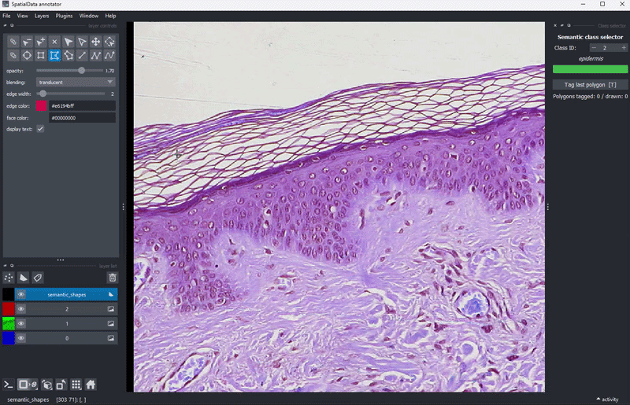
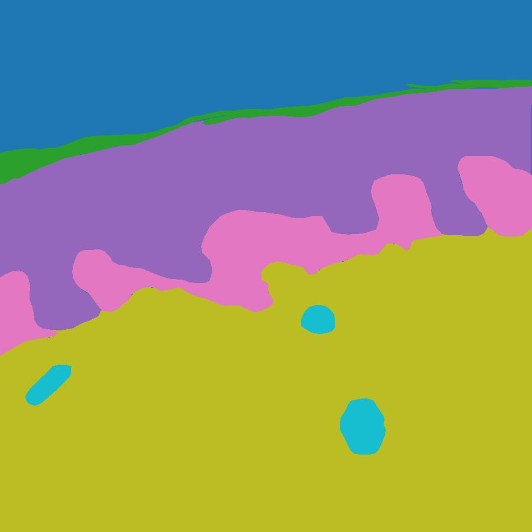

# Annotating RGB images in the Jupyter notebook
Annotating RGB images (virtual H&E, H&E, etc) is a core capability of this method. Once installed, import the relevant modules:
```python
from __future__ import annotations

import numpy as np
import spatialdata
from spatialdata.models import Image2DModel

from LayerForge import (
    open_in_napari,
    add_labels_layer,
    add_shapes_layer,
    labels_layer_to_sdata,
    shapes_layer_to_sdata,
    rasterize_shapes_to_labels,
    run_annotation_session,
    measure_label_morphology
)

from skimage import data

import spatialdata as sd
import spatialdata_plot

from spatialdata.models import Image2DModel
```

This tutorial will use `scikit-image`'s 'skin' RGB image. Access it and store it as a spatialdata object, run the following cell:
```python
full_img = data.skin()

img = full_img[:900, :900]

# img is (y, x, c) — transpose to (c, y, x) for spatialdata
img_cyx = np.moveaxis(img, -1, 0)  # (3, 900, 900)

image = Image2DModel.parse(
    img_cyx,
    dims=("c", "y", "x"),
    scale_factors=[2, 2],   # 900 → 450 → 225, both divisible by 2
)

sdata = sd.SpatialData(images={"skin": image})
sdata
```
This cell should print
```markdown
SpatialData object
└── Images
      └── 'skin': DataTree[cyx] (3, 900, 900), (3, 450, 450), (3, 225, 225)
with coordinate systems:
    ▸ 'global', with elements:
        skin (Images)
```
The image can now be visualised using the command:
```python
sdata.pl.render_images("skin").pl.show()
```
## Annotating
This method will allow you to view the MSI stored in the SpatialData object, accessible by a given `image_key`, storing the annotated shape objects in a specified `shapes_key` and subsequently produce a labels layer at `labels_from_shapes_key`. LayerForge will parse through the shapes objects (including overlapping shapes) and prioritise shapes with a smaller area. 


> This allows for small vessels, artefacts, or any other annotation to be nested within larger polygon feature annotations. 


In the following example we will annotate some of the visible histological layers on the `scikit-image` provided data, including:

* _stratum corneum_,
* _epidermis_,
* _papillary dermis_,
* _reticular dermis_, and
* _vascular structures_

By default, unannotated regions are labelled class 0.

```python
IMAGE_KEY = "skin"
SHAPES_KEY = "shapes_semantic"
LABELS_FROM_SHAPES_KEY = "labels_from_shapes"

CLASS_LABELS = {
    1:  "stratum corneum",
    2:  "epidermis",
    3:  "papillary dermis",
    4:  "reticular dermis",
    5:  "vascular_structure",
}

run_annotation_session(
    sdata,
    image_key=IMAGE_KEY,
    mode="shapes",
    shapes_element_name=SHAPES_KEY,
    labels_element_name=LABELS_FROM_SHAPES_KEY,
    scale_factors=[2, 2],
    class_labels=CLASS_LABELS,
)
```
> calling `run_annotation_session` will prompt the napari viewer to open
### Using the Napari window
Users can draw polygons using the polygon tool. After finishing the shape,  use the window on the top right to select the class you would like to assign the shape to and press the `tag last polygon` button or press the letter `T` on the keyboard. The polygon boundary will change to the colour of the class it is assigned to.

### Finishing a session
To finish an annotation session, close the Napari viewer window.


Now, when you close the Napari viewer window, the labels layer will automatically generate:
```markdown
SpatialData object
├── Images
│     └── 'skin': DataTree[cyx] (3, 900, 900), (3, 450, 450), (3, 225, 225)
├── Labels
│     └── 'labels_from_shapes': DataTree[yx] (900, 900), (450, 450), (225, 225)
└── Shapes
      └── 'shapes_semantic': GeoDataFrame shape: (9, 2) (2D shapes)
with coordinate systems:
    ▸ 'global', with elements:
        skin (Images), labels_from_shapes (Labels), shapes_semantic (Shapes)
```
This can be visualised using:
```python
sdata.pl.render_images(IMAGE_KEY).pl.render_labels(LABELS_FROM_SHAPES_KEY).pl.show(coordinate_systems="global")
```

> n.b. the user's annotations will naturally vary. To continue the tutorial, load sample labels using the following:
```python
from LayerForge import load_skin_sample, SKIN_CLASS_LABELS

sdata2 = load_skin_sample() # this will load a preannotated sdata object
sdata2
```
## Managing the shapes layer
Now that shapes layer conflicts have been resolved in the background to create the labels layer, the shapes and labels layers will diverge. To manage this, run the following:
```python
import rasterio

# Only run if you used Option B (shapes annotation)
if SHAPES_KEY in sdata.shapes:
    rasterize_shapes_to_labels(
        sdata,
        shapes_key=SHAPES_KEY,
        image_key=IMAGE_KEY,
        element_name=LABELS_FROM_SHAPES_KEY,
        class_column="class_id",
        scale_factors=[2, 2, 2],
    )
    print(sdata.labels[LABELS_FROM_SHAPES_KEY])
else:
    print(f"No shapes found under key '{SHAPES_KEY}'. Run Option B first.")
```
```python
sdata2
```
```markdown
SpatialData object
├── Images
│     └── 'skin': DataTree[cyx] (3, 900, 900), (3, 450, 450), (3, 225, 225)
├── Labels
│     └── 'labels_from_shapes': DataTree[yx] (900, 900), (450, 450), (225, 225), (112, 112)
└── Shapes
      └── 'shapes_semantic': GeoDataFrame shape: (9, 2) (2D shapes)
with coordinate systems:
    ▸ 'global', with elements:
        skin (Images), labels_from_shapes (Labels), shapes_semantic (Shapes)
```
### Feature extraction
We can now use our shapes layer to make morphological measurements of our structures:
```python
measure_label_morphology(sdata2, labels_key=LABELS_FROM_SHAPES_KEY, 
                         shapes_key=SHAPES_KEY,
                         image_key= IMAGE_KEY,
                         element_name="tissue_annotation_morphology")

# Access results
sdata2.tables["tissue_annotation_morphology"].obs  # pandas DataFrame with all features
```
| instance_id | area | perimeter | eccentricity | solidity | extent | orientation | axis_major_length | axis_minor_length | centroid-0 | centroid-1 | ... | 0_min_intensity | 1_mean_intensity | 1_max_intensity | 1_min_intensity | 2_mean_intensity | 2_max_intensity | 2_min_intensity | class_id | region | instance_id |
|---|---|---|---|---|---|---|---|---|---|---|---|---|---|---|---|---|---|---|---|---|---|
| 1 | 15422.0 | 2188.56 | 0.9993 | 0.3625 | 0.0963 | -1.4011 | 1117.14 | 41.77 | 214.78 | 348.03 | ... | 36.0 | 137.26 | 255.0 | 0.0 | 172.93 | 255.0 | 18.0 | 1 | shapes_semantic | 1 |
| 2 | 172960.0 | 3020.49 | 0.9682 | 0.7089 | 0.4653 | -1.3422 | 1046.71 | 261.84 | 313.43 | 419.27 | ... | 3.0 | 136.58 | 255.0 | 0.0 | 175.88 | 255.0 | 20.0 | 2 | shapes_semantic | 2 |
| 3 | 12582.0 | 448.53 | 0.7739 | 0.9741 | 0.7342 | 0.6659 | 161.41 | 102.23 | 327.01 | 843.43 | ... | 39.0 | 163.01 | 255.0 | 0.0 | 186.89 | 255.0 | 21.0 | 3 | shapes_semantic | 3 |
| 4 | 49622.0 | 1873.13 | 0.9774 | 0.5662 | 0.3393 | -1.3415 | 690.48 | 145.91 | 421.75 | 452.43 | ... | 58.0 | 167.48 | 255.0 | 2.0 | 193.65 | 255.0 | 43.0 | 3 | shapes_semantic | 4 |
| 5 | 7352.0 | 428.69 | 0.8401 | 0.7945 | 0.5210 | 0.1255 | 145.11 | 78.71 | 529.07 | 29.58 | ... | 51.0 | 166.65 | 255.0 | 21.0 | 190.61 | 255.0 | 59.0 | 3 | shapes_semantic | 5 |
| 6 | 371741.0 | 3595.16 | 0.8726 | 0.9346 | 0.7989 | -1.4184 | 1036.94 | 506.49 | 683.05 | 486.19 | ... | 4.0 | 169.15 | 255.0 | 0.0 | 191.21 | 255.0 | 0.0 | 4 | shapes_semantic | 6 |
| 7 | 2262.0 | 177.20 | 0.5497 | 0.9839 | 0.7959 | 1.4528 | 58.89 | 49.19 | 540.63 | 538.40 | ... | 46.0 | 157.77 | 255.0 | 0.0 | 175.91 | 255.0 | 14.0 | 5 | shapes_semantic | 7 |
| 8 | 2705.0 | 227.32 | 0.9340 | 0.9744 | 0.5026 | -0.8400 | 98.75 | 35.29 | 649.67 | 81.29 | ... | 21.0 | 164.22 | 255.0 | 0.0 | 185.22 | 255.0 | 43.0 | 5 | shapes_semantic | 8 |
| 9 | 5719.0 | 290.35 | 0.6413 | 0.9798 | 0.7718 | 0.1297 | 97.57 | 74.87 | 721.50 | 613.74 | ... | 17.0 | 148.12 | 255.0 | 0.0 | 179.52 | 255.0 | 7.0 | 5 | shapes_semantic | 9 |

*9 rows × 26 columns*


