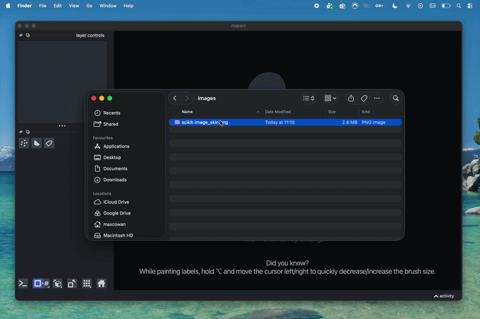
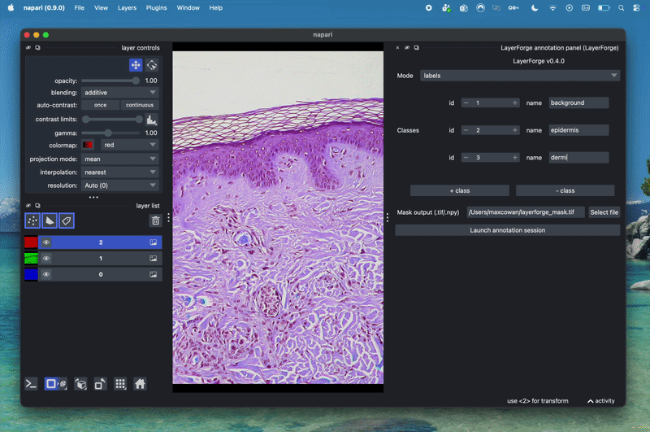

# Annotating images in the Napari App

## Part 1 — Open your image

1. Open napari.
2. Open your image one of two ways:
      - **File → Open File(s)…** and select your image, **or**
      - drag the image file from your file browser straight onto the
        napari window.
3. Supported file types: `.tif`, `.tiff`, `.png`, `.jpg`, `.jpeg`.
4. Your image appears in the viewer. If it has multiple channels
   (e.g. fluorescence channels), each one appears as its own row in the
   **layer list** on the bottom left — click the eye icon next to a
   layer to show/hide it, and use the layer's contrast slider to adjust
   brightness.

If nothing appears, double check the file type is one of the four
listed above.

---

## Part 2 — Set up the annotation panel

1. From the menu bar, choose **Plugins → LayerForge → LayerForge
   annotation panel**. A new panel docks on the right-hand side of the
   window. Its title shows the installed version, e.g. "LayerForge
   v0.4.0" — useful if you ever need to report a bug.

2. **Define your classes.** Each row is one class: a number (`id`) and
   a name. For example, for skin histology you might define:

   | id | name |
   |----|------|
   | 1  | epidermis |
   | 2  | dermis |
   | 3  | vascular structure |

      - Click **+ class** to add another row.
      - Click **- class** to remove the last row.
      - Class `0` is reserved for "unannotated / background" — you don't
        need to define it yourself.

3. **Choose a mode**, from the **Mode** dropdown:
      - **labels** — you paint pixel-by-pixel with a brush, like a
        colouring tool. Best for irregular, textured regions.
      - **shapes** — you draw a polygon outline around each structure.
        Best for distinct, countable objects.

   If you're not sure which to use, ask your team — this only affects
   *how* you draw, both produce the same kind of output.

4. **Choose where to save.** The **Mask output** field is pre-filled
   with a default location in your home folder — click the folder icon
   to change it. The filename must end in `.tif`, `.tiff`, or `.npy`
   (ask your team which one they want; `.tif` is usually the safe
   choice). Pick a location you'll remember, ideally the same shared
   project folder your team uses.

5. Click **Launch annotation session**.

   If you see a red error banner instead (for example "open an image
   first"), it means a step above was missed — open an image (Part 1)
   before clicking Launch.

---

## Part 3 — Annotate

### If you chose "labels" mode

- A new, empty **Labels** layer is added on top of your image.
- In the layer controls (top left, once the Labels layer is selected),
  pick the **paint brush** tool and set the **label** number to match
  one of the class `id`s you defined (e.g. `1` for epidermis).
- Paint over the region. Unpainted pixels stay `0` (background).
- Use the **eraser** tool (or paint with label `0`) to correct mistakes.
- Switch the label number between classes as you move between
  structures — you don't need to finish one class before starting
  another.

### If you chose "shapes" mode

- A small **Class selector** panel appears (separate from the
  LayerForge annotation panel) with a class-ID number box and a
  coloured swatch.
- Draw a polygon: select the polygon tool in the layer controls, click
  to place each vertex, and double-click (or press Enter) to close the
  shape.
- Set the **Class ID** box in the Class selector to the right class,
  then click **Tag last polygon** (or just press **T**) to assign that
  class to the polygon you just drew. Its outline changes colour to
  confirm.
- Repeat: draw the next polygon, set the class ID, tag it. Overlapping
  polygons are fine — smaller ones win over larger ones automatically,
  so a small artefact drawn inside a larger region stays correctly
  labelled.

---

## Part 4 — Save your work

You don't need to click a separate "Save" button — **just close the
napari window** (the ✕ in the corner, or your OS's normal window-close
shortcut) once you're done annotating.

Closing the window automatically:

1. Saves your annotation into the mask file you chose in Part 3
   (the `.tif`/`.tiff`/`.npy` file).
2. Saves a matching `.zarr` folder next to it, with the same name (e.g.
   `mask.tif` → `mask.zarr`). This folder holds the full annotated
   dataset (image + classes) that your team's tools will read — don't
   rename or move it separately from the mask file.

**Before you close the window**, double-check:

- You've annotated everything you intended to (there's no undo once
  the window is fully closed and the app exits).
- The output path shown in the panel is still the one you want.

If shapes mode is selected but you didn't draw anything, nothing is
saved (rather than an empty file) — you'll see a note about this if you
check with your team; it's expected behaviour, not an error.

Hand off both the mask file and the `.zarr` folder to your team (e.g.
by leaving them in the shared project folder) once you're done.

---

## Troubleshooting

| Problem | What to do |
|---|---|
| Plugin doesn't appear under **Plugins → LayerForge** | Re-do [installation](../install.md) and restart napari. |
| Red "open an image first" banner | Open your image (Part 2) before clicking **Launch annotation session**. |
| Red banner about the output path | Make sure the filename ends in `.tif`, `.tiff`, or `.npy`. |
| Image doesn't open at all | Check the file type is `.tif`/`.tiff`/`.png`/`.jpg`/`.jpeg`. |
| Not sure which mode to use | Ask your team — see the mode explanation in Part 3, step 3. |

For anything else, contact your team with: the LayerForge version shown
at the top of the annotation panel, what you were trying to do, and a
screenshot of any error banner.